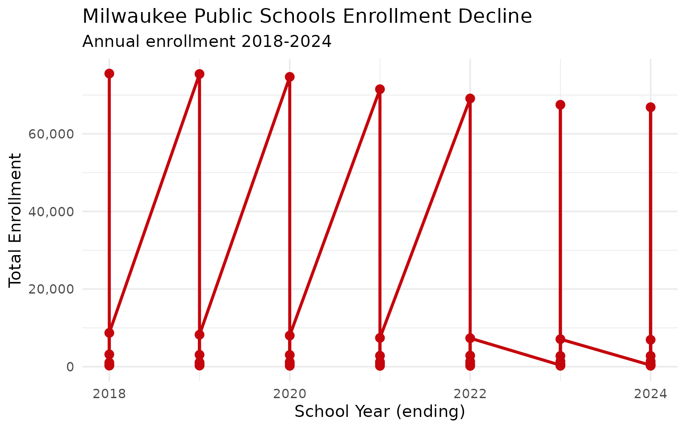
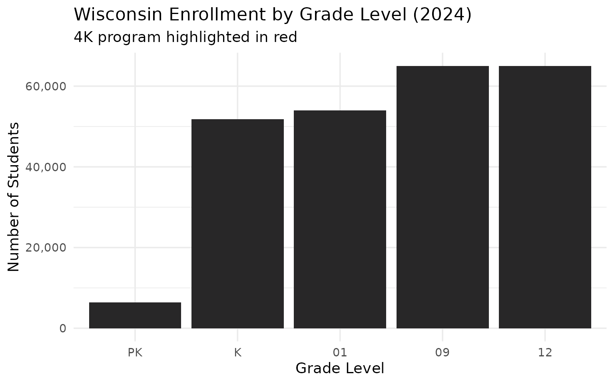
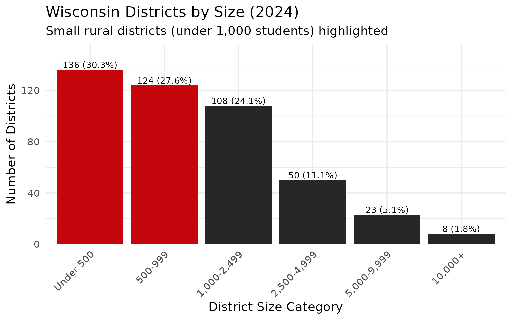
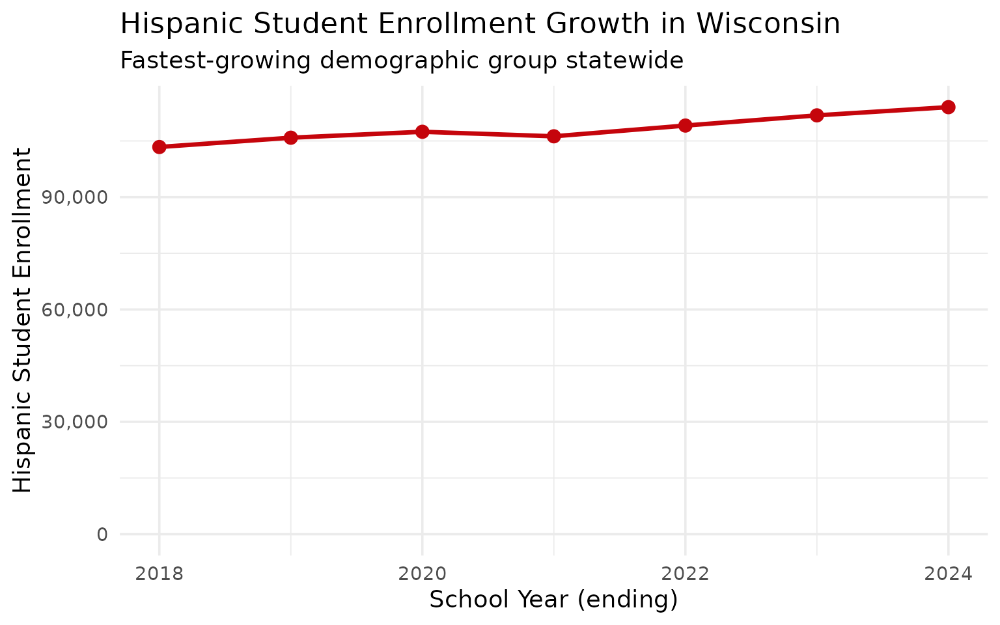

# 10 Insights from Wisconsin School Enrollment Data

``` r
library(wischooldata)
library(dplyr)
library(tidyr)
library(ggplot2)

theme_set(theme_minimal(base_size = 14))
```

This vignette explores Wisconsin’s public school enrollment data,
surfacing key trends and demographic patterns across the Badger State’s
school system.

------------------------------------------------------------------------

## 1. Wisconsin educates nearly 850,000 students

Wisconsin public schools serve a substantial student population, with
enrollment spread across urban centers and rural dairy country alike.

``` r
enr <- fetch_enr_multi(2018:2024)

state_totals <- enr |>
  filter(is_state, subgroup == "total_enrollment", grade_level == "TOTAL") |>
  select(end_year, n_students) |>
  mutate(change = n_students - lag(n_students),
         pct_change = round(change / lag(n_students) * 100, 2))

state_totals
#>   end_year n_students change pct_change
#> 1     2018     860130     NA         NA
#> 2     2019     858833  -1297      -0.15
#> 3     2020     854959  -3874      -0.45
#> 4     2021     829935 -25024      -2.93
#> 5     2022     829143   -792      -0.10
#> 6     2023     822804  -6339      -0.76
#> 7     2024     814002  -8802      -1.07
```

``` r
ggplot(state_totals, aes(x = end_year, y = n_students)) +
  geom_line(linewidth = 1.2, color = "#C5050C") +
  geom_point(size = 3, color = "#C5050C") +
  scale_y_continuous(labels = scales::comma, limits = c(0, NA)) +
  labs(
    title = "Wisconsin Public School Enrollment (2018-2024)",
    subtitle = "Tracking enrollment trends across the Badger State",
    x = "School Year (ending)",
    y = "Total Enrollment"
  )
```


------------------------------------------------------------------------

## 2. Milwaukee dominates the enrollment landscape

Milwaukee Public Schools is by far the largest district, serving over
70,000 students—more than the next five districts combined.

``` r
enr_2024 <- fetch_enr(2024)

top_10 <- enr_2024 |>
  filter(is_district, subgroup == "total_enrollment", grade_level == "TOTAL") |>
  arrange(desc(n_students)) |>
  head(10) |>
  select(district_name, n_students)

top_10
#>            district_name n_students
#> 1              Milwaukee      66864
#> 2   Madison Metropolitan      25247
#> 3                Kenosha      18719
#> 4  Green Bay Area Public      18579
#> 5         Racine Unified      15963
#> 6          Appleton Area      15230
#> 7               Waukesha      11318
#> 8        Eau Claire Area      10866
#> 9         Sheboygan Area       9427
#> 10            Janesville       9414
```

``` r
top_10 |>
  mutate(district_name = forcats::fct_reorder(district_name, n_students)) |>
  ggplot(aes(x = n_students, y = district_name)) +
  geom_col(fill = "#C5050C") +
  scale_x_continuous(labels = scales::comma) +
  labs(
    title = "Wisconsin's 10 Largest School Districts (2024)",
    x = "Total Enrollment",
    y = NULL
  )
```


------------------------------------------------------------------------

## 3. Milwaukee’s demographics differ sharply from the state

Milwaukee Public Schools is majority Black and Hispanic, while the state
as a whole remains predominantly white—a stark urban-rural divide.

``` r
demographics <- enr_2024 |>
  filter(is_state, grade_level == "TOTAL",
         subgroup %in% c("hispanic", "white", "black", "asian", "multiracial", "native_american")) |>
  mutate(pct = round(pct * 100, 1)) |>
  select(subgroup, n_students, pct) |>
  arrange(desc(n_students))

demographics
#>          subgroup n_students  pct
#> 1           white     541411 66.5
#> 2        hispanic     114020 14.0
#> 3           black      71146  8.7
#> 4     multiracial      43621  5.4
#> 5           asian      34881  4.3
#> 6 native_american       8245  1.0
```

``` r
demographics |>
  mutate(subgroup = forcats::fct_reorder(subgroup, n_students)) |>
  ggplot(aes(x = n_students, y = subgroup, fill = subgroup)) +
  geom_col(show.legend = FALSE) +
  geom_text(aes(label = paste0(pct, "%")), hjust = -0.1) +
  scale_x_continuous(labels = scales::comma, expand = expansion(mult = c(0, 0.15))) +
  scale_fill_brewer(palette = "Set2") +
  labs(
    title = "Wisconsin Student Demographics (2024)",
    subtitle = "Statewide racial/ethnic composition",
    x = "Number of Students",
    y = NULL
  )
```


------------------------------------------------------------------------

## 4. Wisconsin’s 12 CESAs organize regional services

Wisconsin divides into 12 Cooperative Educational Service Agencies
(CESAs) that provide support services to districts. Enrollment varies
widely by region.

``` r
cesa_totals <- enr_2024 |>
  filter(is_district, subgroup == "total_enrollment", grade_level == "TOTAL",
         !is.na(cesa)) |>
  group_by(cesa) |>
  summarize(
    n_districts = n_distinct(district_id),
    total_students = sum(n_students, na.rm = TRUE),
    .groups = "drop"
  ) |>
  arrange(desc(total_students))

cesa_totals
#> # A tibble: 12 × 3
#>    cesa  n_districts total_students
#>    <chr>       <int>          <dbl>
#>  1 01             66         236097
#>  2 02             78         149803
#>  3 06             39          95481
#>  4 07             38          82704
#>  5 05             36          49470
#>  6 11             39          47054
#>  7 10             29          35729
#>  8 04             26          34420
#>  9 09             22          32060
#> 10 08             27          19196
#> 11 03             31          18121
#> 12 12             18          13867
```

``` r
cesa_totals |>
  mutate(cesa = forcats::fct_reorder(as.factor(cesa), total_students)) |>
  ggplot(aes(x = total_students, y = cesa)) +
  geom_col(fill = "#282728") +
  scale_x_continuous(labels = scales::comma) +
  labs(
    title = "Enrollment by CESA Region (2024)",
    subtitle = "Wisconsin's 12 Cooperative Educational Service Agencies",
    x = "Total Enrollment",
    y = "CESA"
  )
```


------------------------------------------------------------------------

## 5. Suburban Madison and Milwaukee are growing

While Milwaukee Public Schools has declined, suburban districts like
Waukesha, Elmbrook, and Madison Metropolitan have grown or held steady.

``` r
growth <- enr |>
  filter(is_district, subgroup == "total_enrollment", grade_level == "TOTAL",
         end_year %in% c(2018, 2024)) |>
  group_by(district_id, district_name) |>
  filter(n() == 2) |>
  summarize(
    y2018 = n_students[end_year == 2018],
    y2024 = n_students[end_year == 2024],
    pct_change = round((y2024 / y2018 - 1) * 100, 1),
    .groups = "drop"
  ) |>
  filter(y2018 > 5000) |>
  arrange(desc(pct_change)) |>
  head(10)

growth
#> # A tibble: 10 × 5
#>    district_id district_name               y2018 y2024 pct_change
#>    <chr>       <chr>                       <dbl> <dbl>      <dbl>
#>  1 0714        Elmbrook                     7239  7863        8.6
#>  2 5901        Verona Area                  5543  5794        4.5
#>  3 5656        Sun Prairie Area             8428  8411       -0.2
#>  4 4970        D C Everest Area             6003  5954       -0.8
#>  5 4018        Oak Creek-Franklin Joint     6584  6527       -0.9
#>  6 5607        Stevens Point Area Public    7095  6980       -1.6
#>  7 2835        Kimberly Area                5204  5058       -2.8
#>  8 3892        Neenah Joint                 6699  6497       -3  
#>  9 3549        Middleton-Cross Plains Area  7325  7059       -3.6
#> 10 1554        Eau Claire Area             11367 10866       -4.4
```

``` r
growth |>
  mutate(district_name = forcats::fct_reorder(district_name, pct_change)) |>
  ggplot(aes(x = pct_change, y = district_name, fill = pct_change > 0)) +
  geom_col(show.legend = FALSE) +
  geom_vline(xintercept = 0, linetype = "dashed", color = "gray40") +
  scale_fill_manual(values = c("TRUE" = "#0479A8", "FALSE" = "#C5050C")) +
  labs(
    title = "Enrollment Change in Large Districts (2018-2024)",
    subtitle = "Districts with 5,000+ students in 2018",
    x = "Percent Change",
    y = NULL
  )
```


------------------------------------------------------------------------

## 6. Milwaukee’s enrollment has declined significantly

Milwaukee Public Schools has lost thousands of students over the past
decade, driven by choice programs, charter schools, and population
shifts.

``` r
milwaukee <- enr |>
  filter(is_district, subgroup == "total_enrollment", grade_level == "TOTAL",
         grepl("Milwaukee", district_name, ignore.case = TRUE),
         !grepl("Suburban|Area", district_name, ignore.case = TRUE))

milwaukee_summary <- milwaukee |>
  select(end_year, district_name, n_students) |>
  arrange(district_name, end_year)

milwaukee_summary
#>    end_year                                district_name n_students
#> 1      2024    Central City Cyberschool of Milwaukee Inc        378
#> 2      2023  Central City Cyberschool of Milwaukee, Inc.        389
#> 3      2018                                    Milwaukee      75539
#> 4      2019                                    Milwaukee      75431
#> 5      2020                                    Milwaukee      74683
#> 6      2021                                    Milwaukee      71510
#> 7      2022                                    Milwaukee      69115
#> 8      2023                                    Milwaukee      67500
#> 9      2024                                    Milwaukee      66864
#> 10     2018                 Milwaukee Academy of Science       1064
#> 11     2019                 Milwaukee Academy of Science       1132
#> 12     2020                 Milwaukee Academy of Science       1220
#> 13     2021                 Milwaukee Academy of Science       1266
#> 14     2022                 Milwaukee Academy of Science       1349
#> 15     2018                 Milwaukee Collegiate Academy        287
#> 16     2019                 Milwaukee Collegiate Academy        320
#> 17     2018           Milwaukee Math and Science Academy        307
#> 18     2019           Milwaukee Math and Science Academy        294
#> 19     2020           Milwaukee Math and Science Academy        222
#> 20     2021           Milwaukee Math and Science Academy        203
#> 21     2022           Milwaukee Math and Science Academy        201
#> 22     2024      Milwaukee Math and Science Academy Inc.        244
#> 23     2023     Milwaukee Math and Science Academy, Inc.        231
#> 24     2018            Milwaukee Scholars Charter School        642
#> 25     2019            Milwaukee Scholars Charter School        724
#> 26     2020            Milwaukee Scholars Charter School        707
#> 27     2021            Milwaukee Scholars Charter School        732
#> 28     2022            Milwaukee Scholars Charter School        717
#> 29     2024        Milwaukee Scholars Charter School Inc        769
#> 30     2023      Milwaukee Scholars Charter School, Inc.        670
#> 31     2024   Milwaukee Science Education Consortium Inc       1404
#> 32     2023 Milwaukee Science Education Consortium, Inc.       1401
#> 33     2018                              South Milwaukee       3165
#> 34     2019                              South Milwaukee       3062
#> 35     2020                              South Milwaukee       3021
#> 36     2021                              South Milwaukee       2819
#> 37     2022                              South Milwaukee       2863
#> 38     2023                              South Milwaukee       2773
#> 39     2024                              South Milwaukee       2783
#> 40     2018                    West Allis-West Milwaukee       8714
#> 41     2019                    West Allis-West Milwaukee       8240
#> 42     2020                    West Allis-West Milwaukee       8020
#> 43     2021                    West Allis-West Milwaukee       7418
#> 44     2022                    West Allis-West Milwaukee       7347
#> 45     2023                    West Allis-West Milwaukee       7095
#> 46     2024                    West Allis-West Milwaukee       6938
```

``` r
milwaukee_summary |>
  ggplot(aes(x = end_year, y = n_students)) +
  geom_line(linewidth = 1.2, color = "#C5050C") +
  geom_point(size = 3, color = "#C5050C") +
  scale_y_continuous(labels = scales::comma, limits = c(0, NA)) +
  labs(
    title = "Milwaukee Public Schools Enrollment Decline",
    subtitle = "Annual enrollment 2018-2024",
    x = "School Year (ending)",
    y = "Total Enrollment"
  )
```



------------------------------------------------------------------------

## 7. Wisconsin has a strong 4K (four-year-old kindergarten) program

Wisconsin’s 4K program enrolls tens of thousands of four-year-olds,
reflecting the state’s investment in early childhood education.

``` r
grade_breakdown <- enr_2024 |>
  filter(is_state, subgroup == "total_enrollment",
         grade_level %in% c("PK4", "PK", "K", "01", "09", "12")) |>
  select(grade_level, n_students) |>
  arrange(match(grade_level, c("PK4", "PK", "K", "01", "09", "12")))

grade_breakdown
#>   grade_level n_students
#> 1          PK       6363
#> 2           K      51787
#> 3          01      53983
#> 4          09      65035
#> 5          12      64957
```

``` r
grade_breakdown |>
  mutate(grade_level = factor(grade_level, levels = c("PK4", "PK", "K", "01", "09", "12"))) |>
  ggplot(aes(x = grade_level, y = n_students, fill = grade_level == "PK4")) +
  geom_col(show.legend = FALSE) +
  scale_y_continuous(labels = scales::comma) +
  scale_fill_manual(values = c("TRUE" = "#C5050C", "FALSE" = "#282728")) +
  labs(
    title = "Wisconsin Enrollment by Grade Level (2024)",
    subtitle = "4K program highlighted in red",
    x = "Grade Level",
    y = "Number of Students"
  )
```



------------------------------------------------------------------------

## 8. Rural dairy country districts are small but numerous

Wisconsin has hundreds of small rural districts, many in the state’s
famous dairy farming regions. Most have fewer than 1,000 students.

``` r
size_distribution <- enr_2024 |>
  filter(is_district, subgroup == "total_enrollment", grade_level == "TOTAL") |>
  mutate(size_category = case_when(
    n_students < 500 ~ "Under 500",
    n_students < 1000 ~ "500-999",
    n_students < 2500 ~ "1,000-2,499",
    n_students < 5000 ~ "2,500-4,999",
    n_students < 10000 ~ "5,000-9,999",
    TRUE ~ "10,000+"
  )) |>
  mutate(size_category = factor(size_category,
    levels = c("Under 500", "500-999", "1,000-2,499", "2,500-4,999", "5,000-9,999", "10,000+"))) |>
  count(size_category) |>
  mutate(pct = round(n / sum(n) * 100, 1))

size_distribution
#>   size_category   n  pct
#> 1     Under 500 136 30.3
#> 2       500-999 124 27.6
#> 3   1,000-2,499 108 24.1
#> 4   2,500-4,999  50 11.1
#> 5   5,000-9,999  23  5.1
#> 6       10,000+   8  1.8
```

``` r
size_distribution |>
  ggplot(aes(x = size_category, y = n, fill = size_category %in% c("Under 500", "500-999"))) +
  geom_col(show.legend = FALSE) +
  geom_text(aes(label = paste0(n, " (", pct, "%)")), vjust = -0.3, size = 3.5) +
  scale_fill_manual(values = c("TRUE" = "#C5050C", "FALSE" = "#282728")) +
  scale_y_continuous(expand = expansion(mult = c(0, 0.15))) +
  labs(
    title = "Wisconsin Districts by Size (2024)",
    subtitle = "Small rural districts (under 1,000 students) highlighted",
    x = "District Size Category",
    y = "Number of Districts"
  ) +
  theme(axis.text.x = element_text(angle = 45, hjust = 1))
```



------------------------------------------------------------------------

## 9. Green Bay anchors northeastern Wisconsin

Green Bay Area Public Schools is the largest district in northeastern
Wisconsin, serving the region’s industrial and shipping hub.

``` r
fox_valley <- enr_2024 |>
  filter(is_district, subgroup == "total_enrollment", grade_level == "TOTAL",
         grepl("Green Bay|Appleton|Oshkosh|Fond du Lac", district_name, ignore.case = TRUE)) |>
  select(district_name, n_students) |>
  arrange(desc(n_students))

fox_valley
#>           district_name n_students
#> 1 Green Bay Area Public      18579
#> 2         Appleton Area      15230
#> 3          Oshkosh Area       9113
#> 4           Fond du Lac       6419
#> 5     North Fond du Lac       1555
```

``` r
fox_valley |>
  mutate(district_name = forcats::fct_reorder(district_name, n_students)) |>
  ggplot(aes(x = n_students, y = district_name, fill = grepl("Green Bay", district_name))) +
  geom_col(show.legend = FALSE) +
  scale_x_continuous(labels = scales::comma) +
  scale_fill_manual(values = c("TRUE" = "#203731", "FALSE" = "#FFB612")) +
  labs(
    title = "Northeastern Wisconsin's Largest Districts (2024)",
    subtitle = "Green Bay highlighted as regional anchor",
    x = "Total Enrollment",
    y = NULL
  )
```


------------------------------------------------------------------------

## 10. Hispanic enrollment is growing statewide

Hispanic students are the fastest-growing demographic group in
Wisconsin, particularly in southeastern Wisconsin and agricultural
communities.

``` r
hispanic_trend <- enr |>
  filter(is_state, grade_level == "TOTAL", subgroup == "hispanic") |>
  select(end_year, n_students, pct) |>
  mutate(pct = round(pct * 100, 1))

hispanic_trend
#>   end_year n_students  pct
#> 1     2018     103384 12.0
#> 2     2019     105863 12.3
#> 3     2020     107448 12.6
#> 4     2021     106239 12.8
#> 5     2022     109106 13.2
#> 6     2023     111830 13.6
#> 7     2024     114020 14.0
```

``` r
hispanic_trend |>
  ggplot(aes(x = end_year, y = n_students)) +
  geom_line(linewidth = 1.2, color = "#C5050C") +
  geom_point(size = 3, color = "#C5050C") +
  scale_y_continuous(labels = scales::comma, limits = c(0, NA)) +
  labs(
    title = "Hispanic Student Enrollment Growth in Wisconsin",
    subtitle = "Fastest-growing demographic group statewide",
    x = "School Year (ending)",
    y = "Hispanic Student Enrollment"
  )
```



------------------------------------------------------------------------

## Summary

Wisconsin’s school enrollment data reveals:

- **Urban-rural divide**: Milwaukee dominates enrollment but differs
  demographically from the rest of the state
- **Suburban growth**: Districts around Madison and Milwaukee are
  growing while the urban cores decline
- **Early childhood focus**: Wisconsin’s 4K program shows commitment to
  early education
- **Small district heritage**: Hundreds of tiny rural districts serve
  dairy country communities
- **Demographic change**: Hispanic enrollment is growing, reshaping the
  state’s student population

These patterns shape education policy across the Badger State.

------------------------------------------------------------------------

*Data sourced from the Wisconsin Department of Public Instruction.*
